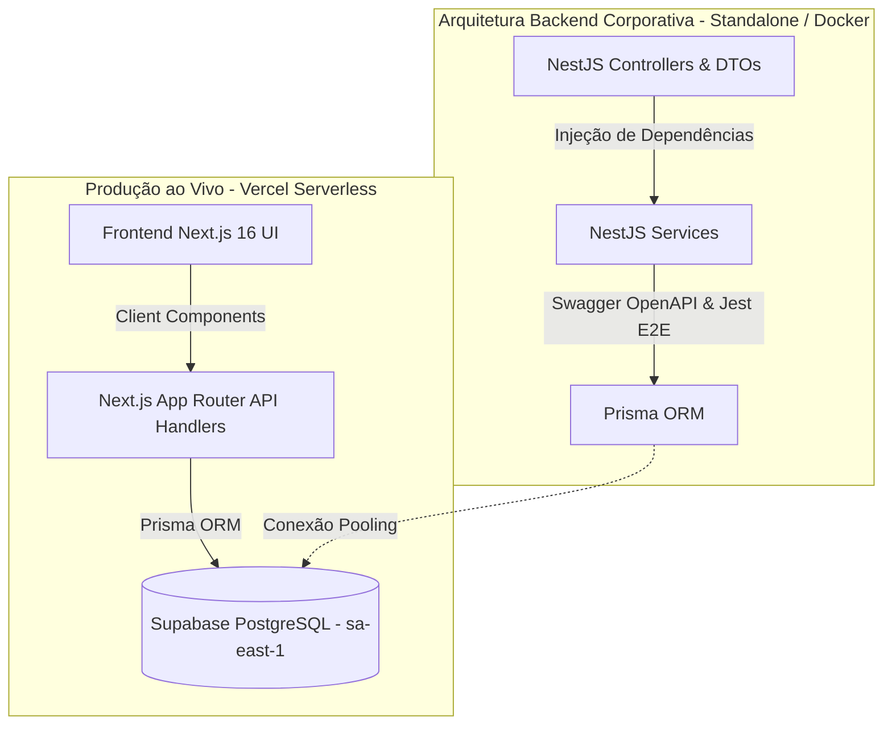

# 💰 HomeFinance - Sistema de Gestão Financeira Residencial

[](https://nextjs.org/)
[](https://react.dev/)
[](https://www.typescriptlang.org/)
[](https://nestjs.com/)
[](https://www.prisma.io/)
[](https://supabase.com/)
[](https://tailwindcss.com/)
[](https://www.docker.com/)
[](https://jestjs.io/)
[](https://homefinancefe.vercel.app)

O **HomeFinance** é uma aplicação completa e escalável para controle financeiro doméstico desenvolvida com **Clean Architecture**, **TypeScript** de ponta a ponta e integração com banco de dados relacional **PostgreSQL (Supabase)**.

A plataforma permite gerenciar moradores, registrar transações de receitas e despesas com validações estritas de regras de negócio (restrição de idade e integridade referencial) e visualizar relatórios consolidados em tempo real.

---

## 🌐 Demonstração Online (Live Demo)

Acesse a aplicação em produção:  
👉 **[homefinancefe.vercel.app](https://homefinancefe.vercel.app)**

---

## 🏛️ Decisão de Arquitetura & Engenharia (Dual-Architecture)

Para atender tanto aos requisitos de **alta disponibilidade e performance em produção** quanto à **demonstração de competências de engenharia de software corporativa para portfólio**, o projeto foi estruturado sob duas abordagens complementares:

```
HomeFinance/
├── frontend/   ➡️ Produção Oficial: Aplicação Full-Stack Next.js 16 (App Router + Route Handlers + Prisma) na Vercel
└── backend/    ➡️ Engenharia Backend: API Corporativa em NestJS (Controllers, Modules, DTOs, Swagger, Docker, Jest)
```



### 1. Camada de Produção Serverless (`/frontend`)
* **Deploy**: Hospedado na **Vercel** com link vitalício de alta disponibilidade.
* **Arquitetura**: Utiliza os **Route Handlers nativos do Next.js 16** (`src/app/api/...`) com Prisma Client Singleton para executar lógica de backend segura nas Serverless Functions da Vercel.
* **Benefícios**: Latência mínima, custo zero, sem risco de hibernação e segurança com credenciais criptografadas no servidor.

### 2. Camada de Backend Corporativo NestJS (`/backend`)
* **Propósito**: Projetada para demonstrar padrões de arquitetura corporativa em larga escala (Enterprise Node.js).
* **Estrutura**:
  * **Injeção de Dependências e Módulos**: `PessoasModule`, `TransacoesModule`, `DashboardModule` e `PrismaModule`.
  * **Validação de Payloads**: DTOs tipados com `class-validator` e `class-transformer`.
  * **Documentação OpenAPI**: Swagger UI interativo integrado em `/api/docs`.
  * **Testes Automatizados**: Suíte de 11 testes E2E com **Jest** e **Supertest**.
  * **Conteinerização**: `Dockerfile` multi-stage e `docker-compose.yml` para ambientes de microsserviços.

---

## ⚙️ Regras de Negócio Implementadas

### 1. Gestão de Moradores (Pessoas)
* CRUD completo (Criação, Leitura, Edição e Exclusão).
* **Deleção em Cascata (Cascade Delete)**: Ao remover um morador, todas as suas transações vinculadas são automaticamente excluídas no banco de dados via chave estrangeira relacional (`onDelete: Cascade`), impedindo registros órfãos.

### 2. Controle de Transações (Receitas e Despesas)
* Registro de movimentações financeiras com descrição, valor, tipo e data personalizada.
* **Restrição de Idade (Validação de Domínio)**: Moradores com **menos de 18 anos são estritamente proibidos de registrar Receitas** (entradas), sendo permitidas apenas **Despesas** (saídas). A regra é validada preventivamente na interface e com bloqueio impeditivo no servidor (`400 Bad Request`).
* **Ordenação Cronológica**: As transações são apresentadas ordenadas da mais recente para a mais antiga.

### 3. Dashboard Consolidado
* **Saldos Individuais**: Apresenta para cada morador o total acumulado de receitas, despesas e o saldo líquido individual (`Receitas - Despesas`).
* **Totais Gerais**: Somatório consolidado de toda a residência (`Total Receitas`, `Total Despesas` e `Saldo Líquido Geral`).

---

## 🛠️ Tecnologias Utilizadas

| Camada | Tecnologias |
| :--- | :--- |
| **Frontend** | React 19, Next.js 16 (Turbopack, App Router), Tailwind CSS v4, Lucide Icons |
| **Backend (NestJS)** | NestJS 10, TypeScript, Swagger / OpenAPI, Class-Validator, RxJS |
| **Persistência / ORM** | Prisma ORM 6, PostgreSQL (Supabase na região de São Paulo `sa-east-1`) |
| **Segurança** | Row Level Security (RLS) habilitado, Sanitização de DTOs, Server-Side Data Fetching |
| **Infra & DevOps** | Vercel (Edge Serverless), Docker, Docker Compose, Git Branching Workflow |
| **Testes** | Jest, Supertest (11/11 Testes E2E cobrindo todas as regras de domínio) |

---

## 📦 Como Executar Localmente

### Pré-requisitos
* **Node.js** (v20 ou superior)
* **Docker** e **Docker Compose** (opcional para rodar banco local)

### 1. Clonando o Repositório
```bash
git clone https://github.com/samuelfrs/HomeFinance.git
cd HomeFinance
```

### 2. Executando a Aplicação Full-Stack (Next.js)
```bash
cd frontend
npm install
npx prisma generate
npm run dev
```
* Acesse no navegador: `http://localhost:3000`

### 3. Populando o Banco com Dados de Demonstração (Seed)
```bash
cd frontend
npx tsx --env-file=.env.local prisma/seed.ts
```

### 4. Executando o Backend Standalone (NestJS)
```bash
cd backend
npm install
npx prisma generate
npm run start:dev
```
* **API**: `http://localhost:5090/api`
* **Swagger Docs**: `http://localhost:5090/api/docs`

### 5. Executando os Testes Automatizados (Jest)
```bash
cd backend
npm run test:e2e
```

---

## 👤 Autor

**Samuel Farias**  
Engenheiro de Telecomunicações (UFC) & Desenvolvedor Full-Stack TypeScript  
* 🌐 **Portfólio**: [samuelfarias.vercel.app](https://samuelfarias.vercel.app)  
* 💼 **LinkedIn**: [linkedin.com/in/samuel-farias-0a8236212](https://www.linkedin.com/in/samuelgfarias/)
* 🐙 **GitHub**: [github.com/samuelfrs](https://github.com/samuelfrs)
